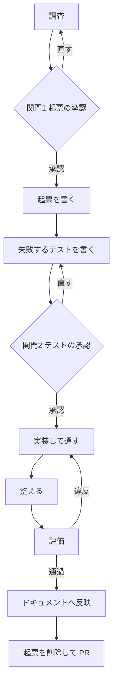

# 変更の進め方

このリポジトリでコードに手を入れるときの手順を定める。何を書くかの規約は `docs/` にある。このスキルが持つのは順序と関門だけである。

書く内容の判断で迷ったら次を読む。ここには写さない。

| 知りたいこと | 置き場 |
|---|---|
| 起票の雛形 | `docs/changes/template.md` |
| コーディング規約と実装の進め方 | `docs/architecture/coding-standards.md` |
| ドキュメントの更新先 | `docs/documentation-rules.md` |
| 機械で判定できる規約 | `docs/architecture/convention-checks.md` |
| 用語 | `docs/domain/shared/glossary.md` |

## このスキルを使わない場面

次のときは使わない。手順を空回りさせるだけである。

| 依頼 | 扱い |
|---|---|
| 調べてほしい、どうなっているか知りたい | 調べて答える。起票もテストも作らない |
| ドキュメントだけを直したい | `documentation-conventions` に従って直す |
| 設定ファイルや依存の更新だけ | 手順に乗せず直接行う |

着手してから対象外だと分かったときは、その場で依頼者に伝えて手順を降りる。起票を作ってしまっている場合は削除する。

## 全体



依頼者には開発の経験が浅い者が多い。各段の初めに、いまどこにいて次に何が起きるかを1文で伝える。黙って進めない。

## 各段で確定するもの

段をまたいで手戻りしないよう、何をどの段で確定させるかを決めてある。早く書きすぎると、後の段で覆ったときに誤った記述が残る。

| 段 | 確定するもの | まだ確定しないもの |
|---|---|---|
| 2 起票 | やること・やらないこと。業務ルールの確定 | 受け入れ基準の文言。実装の詳細。未確定事項の確定 |
| 4 関門2 | 何を確かめるか（仕様の確定点） | — |
| 5 実装 | 受け入れ基準の ID（新設する場合） | 受け入れ基準の文言 |
| 8 反映 | 受け入れ基準の文言 | — |

受け入れ基準の文言を段2で書かないのは、関門2で差し戻されると誤った記述が恒久文書に残るためである。逆に業務ルールの確定を段2で行うのは、関門1で承認済みの判断であり、テストの内容によって覆らないためである。

未確定事項の確定はどの段でも行わない。この手順の外にある業務判断だからである。

## 0 調査

実装に入る前に、関係する既存の仕様と実装を読む。

- `docs/domain/open-questions.md` を見る。依頼の主題が未確定として記録済みかもしれない。記録があったときは次で分ける
  - 依頼が暫定方針と同じ方向 → そのまま進める
  - 依頼が暫定方針を覆す方向 → 関門1の提示に、その矛盾と未確定事項の ID を含める。新しい関門を立てない。承認されても `open-questions.md` は書き換えない（段2を見る）
  - 記録がなく判断できない → 勝手に決めず、関門1で確認する
- 触る機能の `docs/specs/features/` を読み、変える受け入れ基準の ID を控える
- `grep -rn` で同じ主題が既に書かれていないか確かめる
- 実装の該当箇所を読む

分からないことが残ったまま関門1へ進まない。分からないまま承認を求めると、依頼者は判断材料を持たないまま「はい」を押すことになる。

## 1 関門1 起票の承認

起票のファイルを作る前に、AskUserQuestion で承認を取る。無断で書き始めない。

提示するものは3点だけにする。全文を読ませない。

- 変更する振る舞い（業務の言葉で。対応する受け入れ基準の ID があれば添える）
- 変更する範囲（責務の単位で。ファイル名を並べない）
- 対象外（この変更でやらないこと）

書き方と選択肢は [references/gates.md](references/gates.md) にある。

承認が得られなかったら段0へ戻る。起票を書き進めない。

## 2 起票を書く

`docs/changes/<変更を表す名前>.md` に `docs/changes/template.md` の雛形で書く。採番しない。ファイル名は英語の小文字とハイフンでつなぐ。`docs/` の他の文書と揃える。

テストの計画を書かない。テストケースの一覧、テストファイルの名前や配置、テストデータの作り方は含めない。それらは段3で実物として示し、段4で承認を取る。

この段で恒久文書へ反映するのは、業務ルールの確定だけである。関門1で承認済みの判断であり、これから書くテストの内容では覆らない。実装後に回すと、起票を消すときに判断の背景ごと失われる。

未確定事項は解消しない。`open-questions.md` の項目を確定済みへ移さない。関門1で「進めてよい」と言われたのは目の前の変更の可否であって、業務ルールを確定させる判断ではない。この2つは答えられる人が違う。混ぜると、変更を承認した人が知らないうちに業務判断の記録が残る。

暫定方針と異なる実装をするときは、起票の「背景」に次を書いて残す。確定の記録は、業務判断ができる人が別途行う。

```
この変更は Q-NNN の暫定方針と異なる。関門1で変更の実施は承認された。
未確定事項の確定は行っていない。確定させるかどうかは別途の判断を要する。
```

受け入れ基準の文言はこの段では書かない。段5と段8で扱う。該当がなければ起票の反映欄に「該当なし」と記す。雛形の反映欄は、この段で反映するものと実装が固まってから反映するものに分かれている。

## 3 失敗するテストを書く

実装より先にテストを書く。この時点では落ちることを確認する。

- 対応する受け入れ基準があれば、テスト関数の直前に AC-ID をコメントで書く
- 対応する受け入れ基準がないときは、新しく振る ID を決めて書く。番号は追加先ファイルの末尾に続ける。`docs/specs/` への追加は段5で行う
- 関数名は日本語で、業務と利用者の視点の言葉にする
- `Arrange`・`Act`・`Assert` をコメントで書く
- 参照データはシーダー、それ以外はファクトリで用意する

書いたら実行し、意図した理由で落ちていることを確かめる。書き間違いで落ちているのか、実装がないから落ちているのかを取り違えない。

```bash
php artisan test --compact --filter=<テスト名>
```

## 4 関門2 テストの承認

実装に入る前に、AskUserQuestion で承認を取る。ここが仕様の確定点である。

テストのコードを見せない。確かめることを業務の言葉で列挙する。依頼者はコードを読めない前提で書く。コードを見せると、判断できないまま承認する形になり、関門が形だけになる。

提示する形は [references/gates.md](references/gates.md) にある。

承認が得られなかったら段3へ戻ってテストを直す。実装に入らない。

## 5 実装して通す

テストを通す実装を書く。通すために必要な範囲を超えて書かない。

起票の対象外に挙げたものに手を出さない。途中で必要だと分かったら、その場で広げずに依頼者へ伝える。

新しい受け入れ基準を作る変更では、実装と一緒に ID と一文を `docs/specs/` の該当ファイルへ追加する。段7の検査が ID の実在を見るため、ここで足しておかないと必ず落ちる。文言は暫定でよく、段8で仕上げる。

## 6 整える

規約に合わせて整理する。振る舞いは変えない。

`composer format` で整形と自動リファクタリングをかける。

## 7 評価

次をすべて通す。1つでも落ちたら段5へ戻る。

```bash
composer pint-test          # 整形
composer check-conventions  # 規約
composer analyze            # 静的解析
composer rector-dry-run     # 旧い記法
php artisan test --compact  # 全テスト
```

これらは規約に合っているかだけを見ており、振る舞いが正しいかは見ていない。全部通っても、正しさを保証したことにはならない。正しさは段4で確定させている。

全テストを通すのは、変えていない振る舞いを壊していないか確かめるためである。着手前から落ちていたものは、この変更とは無関係である。`git stash` で変更前に戻して同じものが同じ理由で落ちるか確かめ、そうなら記録して先へ進んでよい。無関係だと確かめずに素通りしない。

## 8 ドキュメントへ反映

この段で扱うのは、受け入れ基準の文言と、データ構造・エンドポイントの記述である。業務ルールは段2で済ませてあるので、ここでは触らない。未確定事項はこの手順では確定させない。

同じ変更のなかで更新する。更新先の対応表は `docs/documentation-rules.md` にある。

文書を増やさず、既存の記述を上書きする。ID は維持する。同じ主題が既に書かれていないか `grep -rn` で確かめてから書く。

段5で追加した受け入れ基準の文言を、ここで仕上げる。ID は段3で決めたものと一致させる。

既存の受け入れ基準には、意味を変えない範囲の加筆をしてよい。根拠となる業務ルールや共通仕様の ID を足す、曖昧な表現を具体化する、といったものである。意味そのものが変わるなら段1へ戻って承認を取り直す。「上書きする」は言い換えだけを指すのではない。

## 9 起票を削除して PR

起票は一時文書である。実装が終わったらファイルごと削除する。恒久的に残す内容は段2と段8で反映済みのはずである。

削除したあと、取り込む前の検査を通す。段7の評価には含まれない項目がここで見られる。

```bash
composer check-conventions-merge
```

コミットは意味のある単位に分ける。何を変えたかではなく、なぜ変えたかを本文に書く。

## 中断したとき

`docs/changes/` に起票が残っていれば、その変更は途中である。再開するときは起票を読み、どの段まで進んでいるかを次で判断する。

| 状態 | いまいる段 |
|---|---|
| 起票がない | 段0 |
| 起票はあるがテストがない | 段3 |
| テストがあり落ちている | 段4 |
| テストが通っている | 段7 |
| 起票が残ったまま実装が終わっている | 段8 |

判断がつかないときは依頼者に聞く。推測で進めない。

## やってはいけないこと

- 関門を飛ばす。承認なしで起票を書く、承認なしで実装に入る
- 関門でテストのコードを見せる
- 実装を書いてからテストを書く
- 起票にテストの計画を書く
- 起票の対象外に挙げたものに手を出す
- 評価が落ちたまま次へ進む
- 起票を残したまま PR を出す
