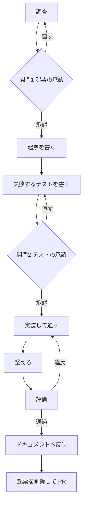

# 変更の進め方

このリポジトリでコードに手を入れるときの手順を定める。何を書くかの規約は `docs/` にある。このスキルが持つのは順序と関門だけである。

書く内容の判断で迷ったら次を読む。ここには写さない。

| 知りたいこと | 置き場 |
|---|---|
| 起票の雛形 | `docs/changes/template.md` |
| コーディング規約と実装の進め方 | `docs/architecture/coding-standards.md` |
| ドキュメントの更新先 | `docs/documentation-rules.md` |
| 機械で判定できる規約 | `docs/architecture/convention-checks.md` |
| 用語 | `docs/domain/shared/glossary.md` |

## 全体



依頼者には開発の経験が浅い者が多い。各段の初めに、いまどこにいて次に何が起きるかを1文で伝える。黙って進めない。

## 0 調査

実装に入る前に、関係する既存の仕様と実装を読む。

- `docs/domain/open-questions.md` を見る。未確定として記録済みかもしれない
- 触る機能の `docs/specs/features/` を読み、変える受け入れ基準の ID を控える
- `grep -rn` で同じ主題が既に書かれていないか確かめる
- 実装の該当箇所を読む

分からないことが残ったまま関門1へ進まない。分からないまま承認を求めると、依頼者は判断材料を持たないまま「はい」を押すことになる。

## 1 関門1 起票の承認

起票のファイルを作る前に、AskUserQuestion で承認を取る。無断で書き始めない。

提示するものは3点だけにする。全文を読ませない。

- 変更する振る舞い（業務の言葉で。対応する受け入れ基準の ID があれば添える）
- 変更する範囲（責務の単位で。ファイル名を並べない）
- 対象外（この変更でやらないこと）

書き方と選択肢は [references/gates.md](references/gates.md) にある。

承認が得られなかったら段0へ戻る。起票を書き進めない。

## 2 起票を書く

`docs/changes/<変更を表す名前>.md` に `docs/changes/template.md` の雛形で書く。採番しない。

テストの計画を書かない。テストケースの一覧、テストファイルの名前や配置、テストデータの作り方は含めない。それらは段3で実物として示し、段4で承認を取る。

恒久的に残す内容は、この段のうちに恒久文書へ反映する。実装後に回すと、起票を消すときに判断の背景ごと失われる。

## 3 失敗するテストを書く

実装より先にテストを書く。この時点では落ちることを確認する。

- 対応する受け入れ基準があれば、テスト関数の直前に AC-ID をコメントで書く
- 関数名は日本語で、業務と利用者の視点の言葉にする
- `Arrange`・`Act`・`Assert` をコメントで書く
- 参照データはシーダー、それ以外はファクトリで用意する

書いたら実行し、意図した理由で落ちていることを確かめる。書き間違いで落ちているのか、実装がないから落ちているのかを取り違えない。

```bash
php artisan test --compact --filter=<テスト名>
```

## 4 関門2 テストの承認

実装に入る前に、AskUserQuestion で承認を取る。ここが仕様の確定点である。

テストのコードを見せない。確かめることを業務の言葉で列挙する。依頼者はコードを読めない前提で書く。コードを見せると、判断できないまま承認する形になり、関門が形だけになる。

提示する形は [references/gates.md](references/gates.md) にある。

承認が得られなかったら段3へ戻ってテストを直す。実装に入らない。

## 5 実装して通す

テストを通す実装を書く。通すために必要な範囲を超えて書かない。

起票の対象外に挙げたものに手を出さない。途中で必要だと分かったら、その場で広げずに依頼者へ伝える。

## 6 整える

規約に合わせて整理する。振る舞いは変えない。

`composer format` で整形と自動リファクタリングをかける。

## 7 評価

次をすべて通す。1つでも落ちたら段5へ戻る。

```bash
composer pint-test          # 整形
composer check-conventions  # 規約
composer analyze            # 静的解析
composer rector-dry-run     # 旧い記法
php artisan test --compact  # 全テスト
```

これらは規約に合っているかだけを見ており、振る舞いが正しいかは見ていない。全部通っても、正しさを保証したことにはならない。正しさは段4で確定させている。

全テストを通すのは、変えていない振る舞いを壊していないか確かめるためである。

## 8 ドキュメントへ反映

同じ変更のなかで更新する。更新先の対応表は `docs/documentation-rules.md` にある。

文書を増やさず、既存の記述を上書きする。ID は維持する。同じ主題が既に書かれていないか `grep -rn` で確かめてから書く。

## 9 起票を削除して PR

起票は一時文書である。実装が終わったらファイルごと削除する。恒久的に残す内容は段2と段8で反映済みのはずである。

削除したあと、取り込む前の検査を通す。段7の評価には含まれない項目がここで見られる。

```bash
composer check-conventions-merge
```

コミットは意味のある単位に分ける。何を変えたかではなく、なぜ変えたかを本文に書く。

## 中断したとき

`docs/changes/` に起票が残っていれば、その変更は途中である。再開するときは起票を読み、どの段まで進んでいるかを次で判断する。

| 状態 | いまいる段 |
|---|---|
| 起票がない | 段0 |
| 起票はあるがテストがない | 段3 |
| テストがあり落ちている | 段4 |
| テストが通っている | 段7 |
| 起票が残ったまま実装が終わっている | 段8 |

判断がつかないときは依頼者に聞く。推測で進めない。

## やってはいけないこと

- 関門を飛ばす。承認なしで起票を書く、承認なしで実装に入る
- 関門でテストのコードを見せる
- 実装を書いてからテストを書く
- 起票にテストの計画を書く
- 起票の対象外に挙げたものに手を出す
- 評価が落ちたまま次へ進む
- 起票を残したまま PR を出す
