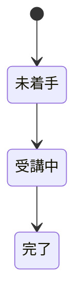

# 受講管理アプリ 仕様書

## プロジェクト概要

Laravel 11 (PHP 8.3) ベースのeラーニングプラットフォーム。
講座、講師、生徒、および学習進捗を管理するAPIサーバーとして機能する。

### 技術スタック

| 項目 | 技術 |
|------|------|
| フレームワーク | Laravel 11 |
| PHP バージョン | 8.3 |
| 認証 | Laravel Sanctum |
| データベース | MySQL（テスト時: SQLite インメモリ） |
| APIドキュメント | dedoc/scramble |
| 静的解析 | PHPStan (Level 5) / Larastan |
| コードフォーマット | Laravel Pint / Rector |

### ユーザーロール

| ロール | 説明 |
|--------|------|
| 管理者（Manager） | 講師の管理・講座の横断的な管理を行う。講師の上位ロール |
| 講師（Instructor） | 講座・チャプター・レッスンの作成・管理、生徒の受講管理を行う |
| 生徒（Student） | 講座を受講し、レッスンの進捗を管理する |

## 用語集

| 用語 | 英語名 | 説明 |
|------|--------|------|
| 講座 | Course | 講師が作成する学習コンテンツの単位 |
| チャプター | Chapter | 講座内の章。順序（order）を持つ |
| レッスン | Lesson | チャプター内の個別の学習項目。順序（order）を持つ |
| 受講 | Attendance | 生徒が講座に登録すること。生徒と講座の紐付け |
| 受講状況 | LessonAttendance | 個別のレッスンごとの受講の状況。受講登録時に、下書きではないレッスンの分が作成される |
| 受講期限 | CourseDeadline | 講座ごとの受講期限設定（なし/固定日/相対日数） |
| お知らせ | Notification | 講座に紐づく通知。常時表示(always)と一度きり(once)の2種類 |
| 仮登録 | Temporary Registration | メール認証前の一時的なユーザー登録状態 |
| タグ | Tag | 講師が作成し講座に紐づける分類ラベル |
| 管理講師 | ManageInstructor | 管理者(Manager)と通常講師の管理関係 |
| ログイン履歴 | StudentLoginHistory | 生徒のログイン記録。ログイン率分析に使用 |

## ビジネスロジック仕様

### データモデルの階層構造

- 「講師」が「講座」を作成・管理する
- 「講座」は「チャプター」を含む（順序付き）
- 「チャプター」は「レッスン」を含む（順序付き）
- 「生徒」は「受講」を通じて「講座」に登録する
- 「受講状況」は個別のレッスンごとの受講の状況を記録する

### 受講と受講状況

- 受講登録時に、講座内の下書きではないレッスンに対して、未着手の受講状況が作成される
- 下書きのレッスンには受講状況を作成しない
- レッスンが新規追加された場合も、その講座の受講者に対して受講状況が作成される
- 下書きのレッスンが公開されたときに、その時点の受講者に対して受講状況が作成される（受講状況のライフサイクルを一貫させるための設計）
- これにより受講状況は、下書きではないレッスンについて、未着手のものも含めてすべて存在する状態になる
- 受講状況の状態は次の順に遷移する

- レッスンの完了は完了日時をもって判定する。状態は画面表示のためのものであり、完了したかどうかは完了日時が記録されているかどうかで判断する
- 完了日時は、一度完了として記録されたら、その後に状態が受講中や未着手へ戻されても保持する。過去に一度でも完了した事実を履歴として残すため、完了日時は上書きしない
- 受講期限の取り扱いについては後述の [受講期限の取り扱い](#受講期限の取り扱い) を参照

### 主な関係性

- マネージャー-講師階層（講師は他の講師を管理可能）
- 分類のための講座タグシステム
- 講座固有の告知のための通知システム
- 生徒と講師両方の一時登録システム

## 受講期限の取り扱い

受講者ごとの受講期限（`Attendance.attendance_deadline`）に関する仕様を定める。

| 項目 | 仕様 |
|------|------|
| 保存形式 | 日付（date）として保存される。時刻情報は持たない |
| 期限の終端 | 期限切れ判定時は、設定された期限日の終端（当日 23:59:59）まで有効として扱う |
| 期限なし | `attendance_deadline` が `null` の場合は期限なし（無期限受講）とみなす |
| 判定ロジック | `Attendance::isExpired()` は現在時刻が「期限日 23:59:59」を過ぎたかで判定する |

例：`attendance_deadline = 2026-12-31` の場合、`2026-12-31 23:59:59` までは受講可能、`2027-01-01 00:00:00` 以降は期限切れとなる。
