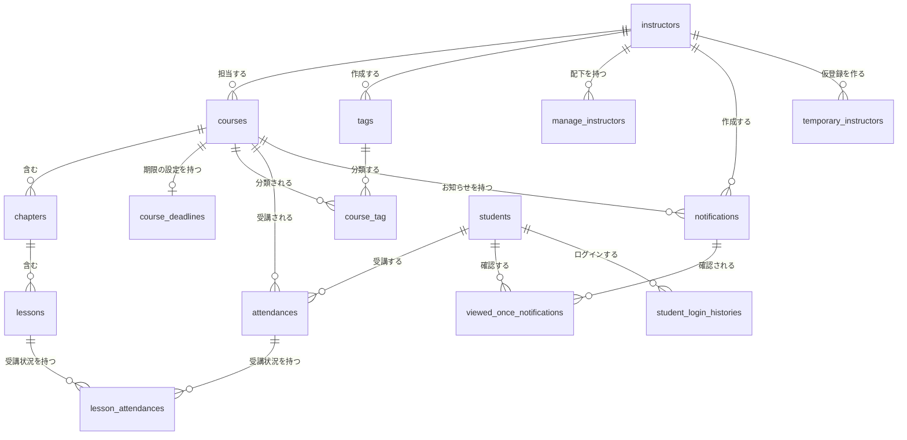

# データモデル

テーブルの役割・カラムの意味・関連を記述する。

型と桁数はマイグレーション（`database/migrations`）を正とし、ここには重複して書かない。日付だけを持つのか日時を持つのかは判定の意味が変わるため明記する。

## 全体の関連

## instructors（講師）

講師とマネージャーの両方を保持する。区分は `type` で表す。

| カラム | 内容 |
|---|---|
| `id` | 主キー |
| `nick_name` | 呼び名。一覧の並び替えに用いる |
| `last_name`・`first_name` | 姓・名 |
| `email` | メールアドレス。一意制約はなく、アプリ側で重複を判定する |
| `password` | ハッシュ化したパスワード |
| `profile_image` | 画像の保存パス。未設定は `null` |
| `type` | `instructor` または `manager` |
| `deleted_at` | 論理削除 |

## students（受講生）

本人が登録した受講生と、講師が代理登録した受講生の両方を保持する。代理登録の場合は `given_name_by_instructor` と `email` 以外が `null` になる。

| カラム | 内容 |
|---|---|
| `id` | 主キー |
| `given_name_by_instructor` | 講師が付けた呼び名。代理登録のときだけ入る |
| `nick_name`・`last_name`・`first_name` | 本人が登録した呼び名・姓・名 |
| `occupation`・`purpose`・`address` | 職業・目的・都道府県 |
| `email` | メールアドレス。一意制約あり |
| `password` | ハッシュ化したパスワード。代理登録では `null` |
| `birth_date` | 生年月日（日付） |
| `gender` | `unknown` / `man` / `woman` |
| `last_login_at` | 最終ログイン日時。ログイン率の判定に用いる |
| `email_verified_at` | 認証日時。現状の登録処理では書き込んでいない |
| `profile_image` | 画像の保存パス |
| `deleted_at` | 論理削除 |

## courses（講座）

| カラム | 内容 |
|---|---|
| `id` | 主キー |
| `instructor_id` | 担当講師 |
| `title` | 講座名 |
| `image` | サムネイル画像の保存パス |
| `status` | `draft` / `public` / `private` |
| `deadline_type` | `none` / `fixed_date` / `relative_days`。既定は `none` |
| `capacity` | 定員。`null` は無制限 |
| `deleted_at` | 論理削除 |

`deadline_type` が期限の決め方を持ち、その具体的な値は `course_deadlines` が持つ。2つのテーブルにまたがるため、片方だけを更新すると不整合になる（Q-012）。

## course_deadlines（講座の受講期限の設定）

講座と1対1で対応する。`deadline_type` が `none` のときはレコードを持たない。

| カラム | 内容 |
|---|---|
| `id` | 主キー |
| `course_id` | 対象の講座 |
| `fixed_date` | 固定の期限日（日付）。`fixed_date` 型のときだけ使う |
| `relative_days` | 受講開始からの日数。`relative_days` 型のときだけ使う |

論理削除は行わない。

## chapters（チャプター）

| カラム | 内容 |
|---|---|
| `id` | 主キー |
| `course_id` | 所属する講座 |
| `order` | 並び順 |
| `title` | 名称 |
| `status` | `draft` / `public` / `private` |
| `deleted_at` | 論理削除 |

## lessons（レッスン）

| カラム | 内容 |
|---|---|
| `id` | 主キー |
| `chapter_id` | 所属するチャプター |
| `order` | 並び順。削除時に一時的に 0 を設定してから詰め直す |
| `title` | 名称 |
| `url` | 学習の参照先 |
| `remarks` | 備考 |
| `status` | `draft` / `public` / `private` |
| `deleted_at` | 論理削除 |

## attendances（受講）

受講生と講座の組み合わせを表す。

| カラム | 内容 |
|---|---|
| `id` | 主キー |
| `course_id`・`student_id` | 受講する講座と受講生 |
| `attendance_deadline` | 受講期限（日付）。`null` は期限なし。講座の設定から算出して複製する |
| `created_at` | 受講開始日時。受講開始からの日数で期限を算出する基点となる |
| `completed_at` | 講座を修了した日時。現状これを書き込む処理はない（Q-007） |
| `deleted_at` | 論理削除 |

同じ講座と受講生の組み合わせに対する一意制約はなく、アプリ側で重複を判定する。

## lesson_attendances（受講状況）

受講とレッスンの組み合わせに対する学習の記録である。

| カラム | 内容 |
|---|---|
| `id` | 主キー |
| `lesson_id`・`attendance_id` | 対象のレッスンと受講 |
| `status` | `before_attendance` / `in_attendance` / `completed_attendance`。表示用の段階 |
| `updated_at` | 最終更新日時。講師向けの期間集計に用いる |
| `completed_at` | 完了日時。完了の判定はこの値で行い、一度入ったら上書きしない |
| `deleted_at` | 論理削除 |

同じ受講とレッスンの組み合わせに対する一意制約はなく、生成時にアプリ側で重複を除外する。

## notifications（お知らせ）

| カラム | 内容 |
|---|---|
| `id` | 主キー |
| `course_id` | 対象の講座 |
| `instructor_id` | 作成した講師。認可の判定に用いる |
| `title`・`content` | 題名・本文 |
| `type` | `always`（常時表示）または `once`（一度きり） |
| `start_date`・`end_date` | 掲示を始める日時・終える日時 |
| `status` | `public` / `private`。既定は `private` |
| `deleted_at` | 論理削除 |

## viewed_once_notifications（お知らせの確認済みの記録）

一度きりのお知らせを受講生が確認したことを記録する中間テーブルである。論理削除は行わない。

| カラム | 内容 |
|---|---|
| `id` | 主キー |
| `notification_id`・`student_id` | 対象のお知らせと受講生 |

## tags（タグ）と course_tag（講座とタグの関連）

| テーブル | 内容 |
|---|---|
| `tags` | `instructor_id`（作成した講師）と `content`（表記）を持つ。論理削除は行わない |
| `course_tag` | 講座とタグの関連。`course_id` と `tag_id` の組み合わせに一意制約がある。論理削除は行わない |

## manage_instructors（マネージャーと配下の講師）

| カラム | 内容 |
|---|---|
| `id` | 主キー |
| `instructor_id` | 配下の講師 |
| `manager_id` | マネージャー |
| `deleted_at` | 論理削除 |

いずれも `instructors` を参照する自己参照の関連である。

## student_login_histories（ログイン履歴）

| カラム | 内容 |
|---|---|
| `id` | 主キー |
| `student_id` | 対象の受講生 |
| `logged_in_at` | ログイン日時。索引を張っている |

論理削除は行わない。連続ログイン日数と学習履歴の集計に用いる。

## temporary_students・temporary_instructors（仮登録）

本登録の前段として保持する。本登録が成立した時点、および失効した時点で物理削除する。

| カラム | 内容 |
|---|---|
| `code` | 認証コード。一意制約あり |
| `token` | 照会用の符号。一意制約あり |
| `expire_at` | 認証コードの有効期限（日時） |
| `trial_count` | 試行回数 |
| `manager_id`（講師のみ） | 手続きを始めたマネージャー。本人が始めた場合は `null` |
| `type`（講師のみ） | 本登録時に設定する区分。現状は常に `instructor` |

そのほかに本登録へ引き渡す入力項目を保持する。

## 削除の方式

| 方式 | テーブル |
|---|---|
| 論理削除 | `instructors`・`students`・`courses`・`chapters`・`lessons`・`attendances`・`lesson_attendances`・`notifications`・`manage_instructors` |
| 物理削除 | `course_deadlines`・`tags`・`course_tag`・`viewed_once_notifications`・`student_login_histories`・`temporary_students`・`temporary_instructors` |

論理削除したレコードは参照時に除外する。存在しない扱いとし、対象を指定する検証でも除外している。

削除は関連するレコードへ連鎖する。

| 起点 | 連鎖 |
|---|---|
| 講座 | チャプター、さらにレッスン。加えて受講期限の設定 |
| チャプター | レッスン |
| 受講 | 受講状況 |
| お知らせ | 確認済みの記録 |

講座を削除しても `course_tag` の関連は残る。タグ側からの削除は関連する講座があると拒否するため、論理削除された講座に付いたタグは削除できない状態になる。

## フレームワークが用意するテーブル

| テーブル | 状態 |
|---|---|
| `personal_access_tokens` | Sanctum が使用する |
| `users` | 使用していない。認証は `students` と `instructors` で行う |
| `password_resets` | 使用していない（パスワード再設定は未実装） |
| `failed_jobs` | 使用していない（キューを利用していない） |

## 実装上の注意

- `attendances` には `progress` というカラムがモデルの更新可能な項目として残っているが、テーブルには存在しない。進捗は都度算出する
- `students.email_verified_at` は仮登録からの本登録処理で書き込んでいない
- 期限の判定に使う値は日付として保持しているため、日時と比較すると当日の扱いがずれる。判定は当日の終わりまでを有効とする実装に揃える必要がある（Q-013）
