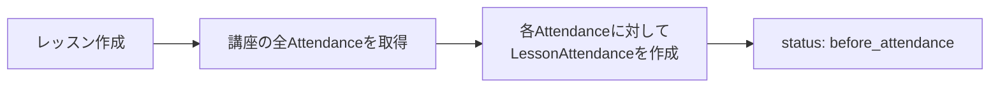
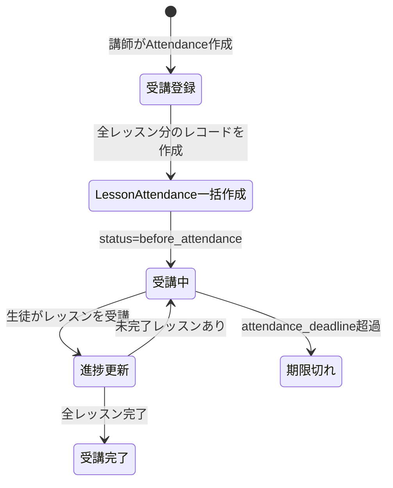
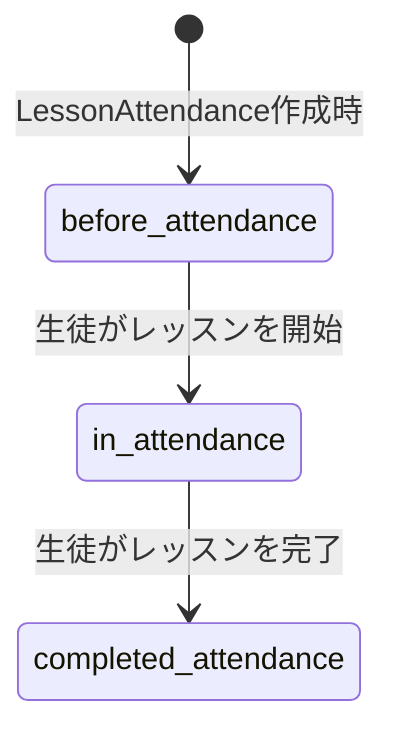
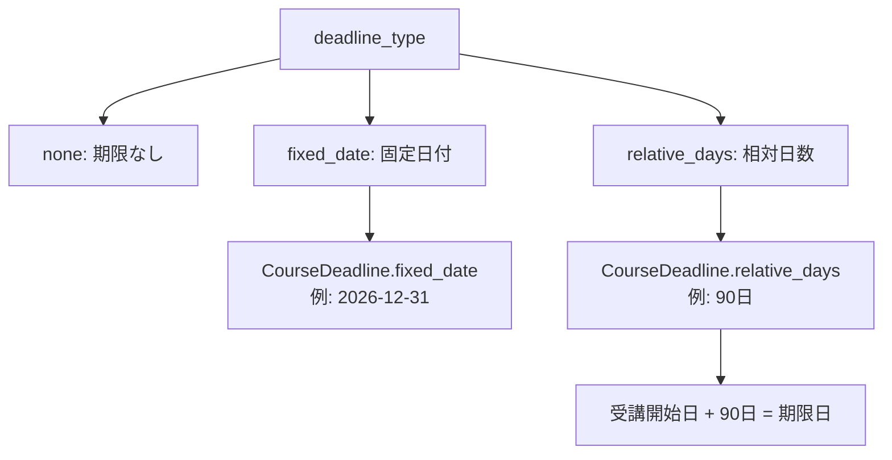
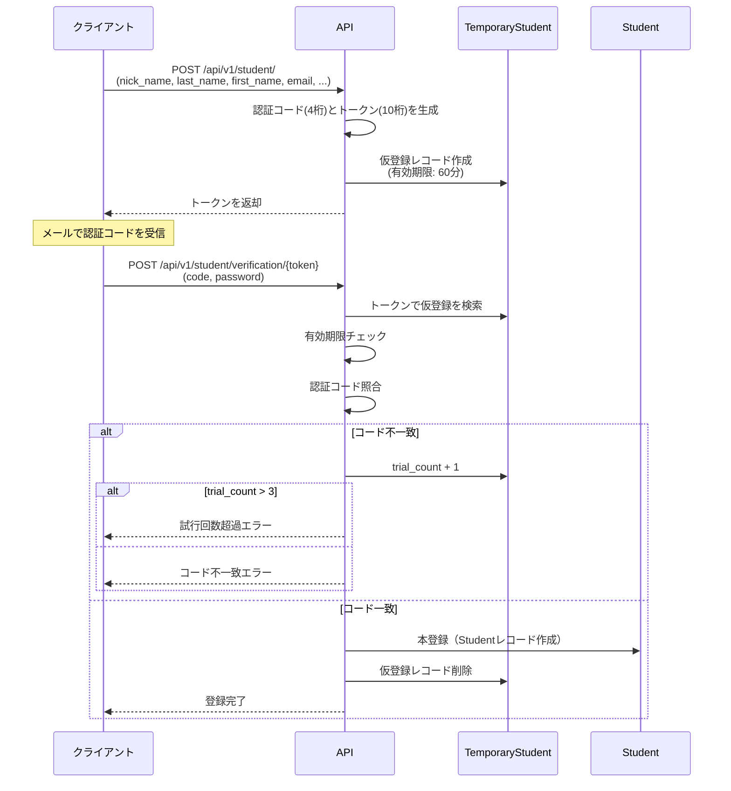

# ビジネスロジック仕様書

## 講座ライフサイクル

### 講座の作成

- **サービス**: `Course\StoreService`
- 初期状態は `private`（非公開）
- 画像はUUIDベースのファイル名で `storage/app/public/course/` に保存
- タグ紐付け（任意）: 指定タグが講師のものであることを検証
- 期限設定（任意）: `CourseDeadline` レコードを同時作成

### 講座の更新

- **サービス**: `Course\UpdateService`
- タイトル、画像、ステータス、期限設定を更新可能
- 期限種別変更時の連鎖動作:
  - **期限削除（none）**: 全受講レコードの `attendance_deadline` をクリア
  - **固定日付（fixed_date）**: 全受講レコードに同一の期限日を設定
  - **相対日数（relative_days）**: 各受講レコードの `created_at` から日数を加算して個別に算出
- 画像変更時は旧画像ファイルを削除

### 講座の削除

- **サービス**: `Course\DeleteService`
- **制約**: 受講レコード（Attendance）が存在する場合は削除不可
- 関連画像ファイルも削除
- カスケード: チャプター → レッスン → CourseDeadline が連鎖削除（Modelのbootイベント）

### 定員管理

- `courses.capacity` カラムで管理（NULLABLE = 定員なし）
- `Course::hasCapacity()` で空きを確認
- 受講登録時に `lockForUpdate()` で排他制御して定員チェック
- 定員超過時: `ValidationException`（"This course has already reached its capacity."）

---

## チャプター管理

### 作成

- **サービス**: `Chapter\CreateChapterService`
- 表示順序（order）は既存チャプター数 + 1 で自動採番
- 初期状態は `public`

### 並び替え

- **サービス**: `Chapter\SortChaptersService`
- チャプターの表示順序を一括更新
- 対象チャプターが指定講座に属することを検証

### ステータス連動

チャプターを `private` に変更すると、配下の全レッスンも `private` に変更される（Model bootイベント）。

### 削除制約

- **サービス**: `Chapter\BulkDeleteChapterService`
- 配下レッスンに `LessonAttendance` レコードが存在する場合は削除不可
- エラー: `AuthorizationException`（"Forbidden, this lesson has attendance."）

---

## レッスン管理

### 作成とLessonAttendance自動作成

- **サービス**: `Lesson\StoreLessonService`
- 表示順序（order）は既存レッスン数 + 1 で自動採番
- **重要**: レッスン作成時、該当講座の全受講レコード（Attendance）に対して `LessonAttendance` レコードを `before_attendance` ステータスで一括作成

### 更新

- **サービス**: `Lesson\UpdateLessonService`
- タイトル、URL、備考、ステータスを更新可能
- タイトルのみの更新: `Lesson\UpdateLessonTitleService`
- ステータスのみの更新: `Lesson\UpdateLessonStatusService`

### 削除

- **サービス**: `Lesson\DeleteLessonService`
- 削除前にレッスンの `order` を `0` に設定
- 削除後に同チャプター内の残レッスンを連番で再採番（1始まり）
- 一括削除: `Lesson\BulkDeleteLessonsService`（再採番を含む）
- 全削除: `Lesson\DeleteAllLessonsService`（LessonAttendanceが存在する場合は拒否）

---

## 受講ライフサイクル

### 状態遷移図

### 受講登録フロー

1. 講師が生徒を講座に登録（`Attendance` 作成）
2. 受講期限が設定されている場合、`attendance_deadline` を算出
3. 講座内の全レッスンに対して `LessonAttendance` レコードを `before_attendance` で一括作成
4. 定員チェック（`lockForUpdate` による排他制御）

### 受講期限算出

- **サービス**: `Attendance\CalculateDeadlineService`

| 期限種別 | 算出ロジック |
|---------|------------|
| `none` | 期限なし（null） |
| `fixed_date` | `CourseDeadline.fixed_date` をそのまま使用 |
| `relative_days` | 受講開始日 + `CourseDeadline.relative_days` 日 |

### 期限切れ判定

- `Attendance::isExpired()` メソッドで判定
- `attendance_deadline` が未設定の場合は常に有効
- 期限切れの場合、講座コンテンツとお知らせの閲覧が拒否される

---

## レッスン受講進捗

### 状態遷移

| ステータス | 値 | 説明 |
|-----------|-----|------|
| 未着手 | `before_attendance` | 受講登録時の初期状態 |
| 受講中 | `in_attendance` | レッスンを開始した状態 |
| 受講完了 | `completed_attendance` | レッスンを完了した状態 |

### 進捗率の算出

- **チャプター進捗**: チャプター内の全レッスンが `completed_attendance` であればそのチャプターは完了
- **講座進捗**: 完了チャプター数 / 全チャプター数 × 100（パーセント）
- 算出メソッド: `Chapter::calculateChapterProgress()`, `Chapter::calculateCompletedLessonCount()`

### レッスン一括完了

- チャプター内全レッスン一括完了: 指定チャプターの全 `LessonAttendance` を `completed_attendance` に更新
- 講座内全チャプター一括完了: 全チャプターの全レッスンを `completed_attendance` に更新

### 受講再開（Continue From）

- **サービス**: `Student\Attendance\ContinueFromService`
- **DTO**: `ContinueFromDto`（chapterId, chapterTitle, lessonId, lessonTitle）
- 最初の未完了レッスン（`before_attendance` または `in_attendance`）を特定して返却
- 全レッスン完了済みの場合は `null` を返却

---

## 受講期限管理

### 期限種別

### 期限変更時の一括更新

講座の期限種別が変更された場合、既存の全受講レコードの `attendance_deadline` が再計算される。

| 変更後の種別 | 動作 |
|------------|------|
| `none` | 全受講の `attendance_deadline` を `null` に設定 |
| `fixed_date` | 全受講に同一の固定日付を設定 |
| `relative_days` | 各受講の `created_at` + 相対日数で個別に算出 |

---

## お知らせシステム

### 種別と既読管理

| 種別 | 値 | 表示動作 | 既読管理 |
|------|-----|---------|---------|
| 常時表示 | `always` | 期間内は常に表示 | なし（常に表示される） |
| 一度きり | `once` | 未読の場合のみ表示 | `viewed_once_notifications` テーブルで管理 |

### お知らせの表示条件

1. お知らせの `status` が `public` であること
2. 現在日時が `start_date` ～ `end_date` の範囲内であること
3. 生徒が対象講座を受講していること
4. 受講が期限切れでないこと
5. `once` 種別の場合、未読であること（`viewed_once_notifications` に既読レコードがないこと）

### 既読マーク処理

- **サービス**: `Notification\MarkReadService`
- `once` 種別のお知らせのみ対象
- `viewed_once_notifications` テーブルにレコードを作成
- 受講期限切れの場合はマーク不可

### フィルタリング

- **Enum**: `FilterEnum`（`read` / `unread`）
- `Notification::scopeFilterByReadStatus()` で既読/未読フィルタリング
- ソート: タイトル、講座ID、開始日でソート可能

---

## 仮登録・認証フロー

### 生徒の仮登録フロー

### 講師の仮登録フロー

- 生徒と同様の認証コード/トークン方式
- `manager_id` を指定可能（管理者配下として登録）
- `type` フィールドで `instructor` として登録

### 認証コード・トークンの生成

- **サービス**: `Auth\CredentialGeneratorService`
- 認証コード: ランダム4文字、ユニーク制約あり（最大5回リトライ）
- 認証トークン: ランダム10文字、ユニーク制約あり（最大5回リトライ）
- リトライ超過時: `DuplicateAuthorizationCodeException` / `DuplicateAuthorizationTokenException`

### 認証コード検証

- **サービス**: `Student\VerifyCodeService` / `Instructor\VerifyCodeService`
- 有効期限切れ: `ExpiredAuthorizationCodeException`
- 試行回数超過（3回超）: `TryCountOverAuthorizationCodeException`
- 不一致時: `trial_count` をインクリメントし、`false` を返却

---

## タグシステム

### 管理構造

- タグは講師単位で管理される（`tags.instructor_id`）
- 1つのタグは複数の講座に紐付け可能（多対多: `course_tag`）
- 1つの講座に複数のタグを紐付け可能

### 削除制約

- **サービス**: `Tag\DeleteTagService`
- 講座に紐づいているタグは削除不可
- エラー: `AuthorizationException`（"Forbidden, this tag is linked to courses."）

### タグによる講座検索

- 受講一覧の取得時にタグIDでフィルタリング可能
- 講座タイトルとタグ内容をまたいだキーワード検索も可能

---

## ログイン率分析

### 概要

講師が受講生のログイン率を期間指定で確認できる機能。

### 分析期間

| 期間 | 定数 | 説明 |
|------|------|------|
| 週 | `Attendance::PERIOD_WEEK` | 直近1週間 |
| 月 | `Attendance::PERIOD_MONTH` | 直近1ヶ月 |
| 年 | `Attendance::PERIOD_YEAR` | 直近1年 |

### 算出ロジック

- `Attendance::calcLoginRate()` メソッドで算出
- `student_login_histories` テーブルの `logged_in_at` を参照
- 指定期間内のログイン日数 / 期間の総日数 でログイン率を計算

### レッスン受講分析期間

| 期間 | 定数 | 説明 |
|------|------|------|
| 本日 | `LessonAttendance::PERIOD_TODAY` | 本日の受講状況 |
| 月 | `LessonAttendance::PERIOD_MONTH` | 直近1ヶ月の受講状況 |

---

## 生徒登録（講師による）

### フロー

- **サービス**: `Student\StoreStudentService`
- DBトランザクション内で実行
- 講座の `lockForUpdate()` で定員の排他制御
- 定員チェック後に `Attendance` 作成 → `LessonAttendance` 一括作成
- 定員超過時: `ValidationException`

### 講師による生徒作成

- `given_name_by_instructor`（講師による呼び名）を設定可能
- メールアドレスと講座IDを指定して受講登録を同時実行
