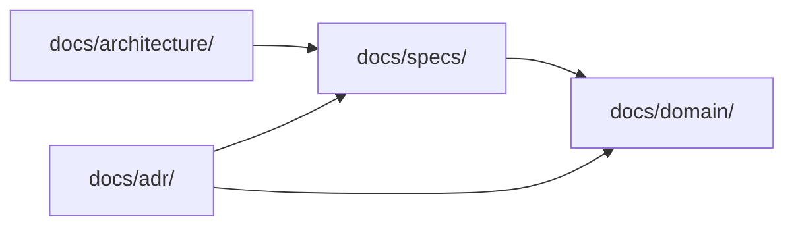

# ドキュメント運用ルール

このプロジェクトでの `docs/` の運用を定める。土台となる考え方は `.claude/skills/documentation-conventions/SKILL.md` にあり、ここではプロジェクト固有の決めごとと、判断に迷ったときの手順だけを書く。

前提として、業務知識とシステム仕様を混ぜない。混ざると、業務のルールが機能ごとに散って再利用できなくなり、実装が終わった時点で業務知識も一緒に捨てられる。

## ディレクトリの役割

| 置き場 | 内容 | 文の主語 | 改修時 |
|---|---|---|---|
| `docs/domain/` | 業務がどうなっているか。用語集・業務ルール・未確定事項 | 業務・人・書類 | 上書き |
| `docs/specs/` | システムの振る舞い。共通仕様と機能ごとの仕様 | システム | 上書き |
| `docs/architecture/` | 技術スタック・データモデル・エンドポイント | システム | 上書き |
| `docs/adr/` | 意思決定の記録 | — | 追記のみ・過去は不変 |
| `docs/changes/` | 変更単位の作業指示。着手時に起票し、実装後に削除する | — | 一時 |

エージェント向けの指示は `AGENTS.md` に置く。索引と、取り違えると壊れる注意点だけを書き、仕様や規約の詳細は `docs/` 側に置く。Claude Code は `CLAUDE.md` から `AGENTS.md` を読み込む。ツールごとに指示を分けない。

## どこに書くかを決める

```
0. その主題は既にどこかに書かれているか（grep -rn で確かめる）
     ├─ はい → その記述を上書きし、ID は維持する。ここで終了
     └─ いいえ ↓
1. その記述の主語は「システム」か
     ├─ はい → docs/specs/
     └─ いいえ ↓
2. このシステムを別の言語で全面的に作り直しても、その記述は残るか
     ├─ はい → docs/domain/
     └─ いいえ ↓
3. 業務ルールに紐づかない機械的な制約（型・桁数・最大文字数）か
     ├─ はい → マイグレーションに任せる（ドキュメントに書かない）
     └─ いいえ → docs/specs/conventions.md
```

「システムは〜しなければならない」の形で書けてしまったら、それはシステム仕様である。業務ルールの文書にこの形が現れたら境界を越えている。

構成そのものの話（どのクラスがその責務を持つか、どのテーブルがその値を持つか）は `docs/architecture/` に置く。振る舞いか構成かで分ける。

判断に迷ったら業務知識の側に寄せる。業務知識に書いた仕様寄りの記述は後から移せるが、仕様に埋めた業務知識は上書き更新のときに一緒に失われる。

## ID 体系

| 対象 | 形式 | 置き場 |
|---|---|---|
| 業務ルール | `BR-SHARED-<連番>` | `docs/domain/shared/business-rules.md` |
| 受け入れ基準 | `AC-<機能>-<連番>` | `docs/specs/conventions.md`・`docs/specs/features/` |
| 意思決定記録 | `ADR-<連番>` | `docs/adr/` |
| 未確定事項 | `Q-<連番>` | `docs/domain/open-questions.md` |

機能の略称は `COMMON`・`AUTHZ`・`ACCOUNT`・`AUTHOR`・`ENROLL`・`PROG`・`ANALYTICS`・`NOTIF`・`TAG` を使う。

番号は振り直さない。削除したときは欠番のまま空け、なぜ欠番になったかをコメントで残す。追加は末尾に足す。既存の主題を書き直すときは、新しい ID を振らずにその記述を上書きする。ID が指すのは主題であり、そのときの記述ではない。

業務領域を分割して文書を移動した場合も、`BR-SHARED-` の接頭辞と番号はそのまま維持する。

## 参照の向き



業務知識から仕様を参照しない。逆参照を持たせると、仕様を追加・変更・削除するたびに業務知識の側の更新が必要になり、業務知識が仕様のライフサイクルに引きずられる。

例外は `docs/domain/open-questions.md` の影響範囲欄だけである。未確定事項は、業務の未確定とシステム仕様の未確定を1か所に集めるための文書であり、どこに跳ねるかを書けないと役に立たない。

どの業務ルールがどこで実現されているかを知りたいときは、逆参照ではなく検索で追う。

```bash
grep -rn 'BR-SHARED-006' docs/
```

## 技術用語の扱い

このプロジェクトのドキュメントは業務側との共有にも使う。そのため書き手が意識する境界を1つ追加する。

| 置き場 | 実装の名前（クラス名・テーブル名・カラム名・サービス名・ファイルパス） |
|---|---|
| `docs/domain/` | 出さない |
| `docs/specs/` | 出さない。エンドポイントの入力項目の名前は必要な範囲で使う |
| `docs/architecture/` | 出す。ここが実装との対応を受け持つ |
| `docs/adr/` | 出す |
| `docs/changes/` | 責務の単位で書き、ファイル名の列挙はしない |

## 用語と文体

用語は `docs/domain/shared/glossary.md` を唯一の正とする。次の表記を揺らさない。言い換えや併記をしない。

| 使う | 使わない |
|---|---|
| 講座 | コース |
| チャプター | 章・セクション |
| レッスン | 単元 |
| 受講状況 | 学習進捗・出席状況 |
| 受講生 | 生徒・ユーザー |
| マネージャー | 管理者 |

レッスン1つに対する受講生の状況は受講状況と呼ぶ。受講生向けの直近30日の集計は学習履歴と呼び、受講状況と混同しない。

文体は次に従う。

- である調で書く
- 太字記法を使わない。強調は見出しと表で表す
- 区切り線を使わない。見出しの階層で区切る
- 説明の地の文でコロンを使わない（コード・表のセル・mermaid の構文内は許容する）
- 図は mermaid で描く。状態の遷移は必ず mermaid で表す
- マークダウンで一系統に管理する。同じ内容の HTML や別形式の文書を作らない

## コードとの二重管理を避ける

| 書く場所 | 対象 |
|---|---|
| ドキュメントを正とする | 業務判断が入るもの（権限による見え方、検索の仕様、状態の遷移、絞り込みの既定値、業務ルールから導かれる必須） |
| マイグレーションを正とする | 業務ルールに紐づかない機械的な制約（型・桁数・単なる入力必須） |
| リソースクラスを正とする | 応答に含める項目の一覧 |
| `AGENTS.md` を正とする | エージェント向けの索引、実装前に押さえる注意点、よく使うコマンド |

このプロジェクトのスキーマ定義は `database/migrations` を正とする。`docs/architecture/data-model.md` にはカラムの意味と関連だけを書き、型と桁数を重複させない。

## 実装が終わったとき

まず、その主題がすでにどこに書かれているかを検索で確かめる。既存の記述があれば ID を維持して上書きし、新しい主題のときだけ末尾に足す。実装後の更新は足すことから入りがちで、ここを飛ばすと同じ振る舞いが2つの ID で並ぶ。

そのうえで、同じ変更のなかで次を更新する。

| 変更内容 | 更新するファイル |
|---|---|
| 振る舞いを変えた | `docs/specs/features/<機能>.md`（上書き） |
| 全エンドポイントに共通する扱いを変えた | `docs/specs/conventions.md`（上書き） |
| データ構造を変えた | `docs/architecture/data-model.md`（上書き） |
| エンドポイントを追加・変更した | `docs/architecture/api.md`（上書き） |
| 実装の構成を変えた | `docs/architecture/overview.md`（上書き） |
| コーディング規約を変えた | `docs/architecture/coding-standards.md`（上書き） |
| 業務ルールが判明・変更された | `docs/domain/shared/business-rules.md`（上書き） |
| 技術選定の判断をした | `docs/adr/` に新しい記録を追加（既存は上書きしない） |
| 方針を覆した | 旧記録のステータスのみ更新し、新しい記録を追加 |

業務ルールを変えたつもりが実はシステムの振る舞いだった、という取り違えがもっとも起きる。主語がシステムなら `docs/specs/` である。

本文を直したら、同じファイルの図が古い振る舞いのまま残っていないかを見る。受け入れ基準だけ直して図を放置すると、次に読む者は図のほうを信じる。

起票（`docs/changes/`）は上の表に含めない。恒久的に残す内容は着手の初期に反映し、実装が終わったら起票ファイルごと削除する。

版を分けたファイル（`*_v2.md`・`*_old.md`・`*_20260817.md`）を作らない。状態を表す文書は上書きし、履歴は Git に任せる。不要になった文書は残さず削除する。

## 起票の置き場と書かないもの

これから作る変更の起票は `docs/changes/` に置く。規模によらずここに一本化し、ほかの置き場を作らない。雛形は `docs/changes/template.md` を使い、採番せず内容が分かるファイル名にする。

起票にはテストの計画を書かない。テストケースの一覧、テストファイルの名前や配置、テストデータの作り方は含めない。完了の条件として既存のテストが通ることだけを書く。テストの実装はドキュメントの外で決める。

## 点検

構成を整理・レビューするときは、機械的に検出できるものから当てる。

```bash
# 業務ルールにシステムを主語にした文が混ざっていないか（0 件であるべき）
grep -rn 'システムは.*しなければ\|してはならない' docs/domain/

# 業務知識から仕様・構成への参照がないか（0 件であるべき。open-questions は例外）
grep -rn 'docs/specs/\|docs/architecture/' docs/domain/ | grep -v open-questions

# 業務知識にテーブル名・カラム名が露出していないか
grep -rn '`[a-z][a-z_]*_[a-z_]*`' docs/domain/

# 欠番になった ID への参照が残っていないか
grep -rn 'BR-SHARED-0NN' docs/
```

2番目の検索は、置き場の説明として `docs/specs/` に言及している行もヒットする。見るのは業務ルールの本文が仕様を指していないかである。3番目の検索は 0 件を目指すものではなく、ヒットしたときにその語が業務の語彙かどうかを確かめるためのものである。

ファイル単位で性質が仕様の側に寄っている文書は、記述単位で削るのではなくファイルごと移す。
