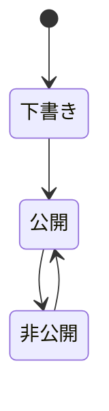
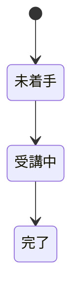

# 業務ルール

<!--
配置先は docs/domain/shared/business-rules.md である。
性質は状態を表す文書であり上書き更新する。
IDは BR-SHARED-<連番> とし、参照側が壊れるため番号は振り直さない
（削除時は欠番のまま空け、追加は末尾に足す）。
主語は業務・人・書類にする。システムを主語にした文は docs/specs/ へ移す。
-->

## 出典の扱い

ここに書かれたルールは、稼働中の実装から復元し、業務側の確認を受けたものである（復元 2026-08-17・確認 2026-08-20）。個別の出典欄は、これと異なる出所を持つルールにだけ記載する。

実装がここに書かれたルールに沿っていない箇所がある。どちらが正しいかについては、このファイルのルールを正とする。個別の箇所は `docs/domain/open-questions.md` に残しており、実装を合わせるかどうかは項目ごとに判断する。

## BR-SHARED-001 講座の担当講師

講座には担当する講師が1人いる。講座を作成した講師が担当講師になり、以後その講座の内容・受講生・お知らせに責任を持つ。担当講師は途中で入れ替わらない。

| 項目 | 内容 |
|---|---|
| 例外 | マネージャーは配下の講師の講座を担当講師と同じように扱える（BR-SHARED-003） |

## BR-SHARED-002 講座の構成

講座はチャプターの並びで構成し、チャプターはレッスンの並びで構成する。並び順には意味があり、受講生は上から順に学習することを想定する。チャプターとレッスンは講座をまたいで共有しない。

## BR-SHARED-003 マネージャーと配下の講師

マネージャーは他の講師を配下に持つ。マネージャーは、自分の講座に加えて配下の講師が担当する講座・その受講生・その講座のお知らせ・その講師のタグを、自分のものと同じように扱える。配下でない講師のものは扱えない。

| 項目 | 内容 |
|---|---|
| 例外 | 配下の講師どうしは互いのものを扱えない |
| 他ルールとの関係 | BR-SHARED-001 の担当講師の範囲を、マネージャーに限って広げる |

## BR-SHARED-004 受講の成立

受講は講師が受講生を講座に登録することで成立する。受講生が自分で講座を選んで申し込むことはしない。同じ受講生を同じ講座に二重に登録することはしない。

## BR-SHARED-005 受講期限の決め方

講座ごとに受講期限の決め方を1つ選ぶ。決め方は次の3種類である。

| 決め方 | 内容 |
|---|---|
| 期限なし | 受講生はいつまでも学習できる |
| 特定の日 | 受講生全員が同じ日を期限とする |
| 受講開始からの日数 | 受講生ごとに、受講を開始した日から数えた日数で期限を決める |

受講期限は受講生ごとに確定した日として持つ。講座の決め方を後から変えた場合、その講座を受講している受講生の期限も新しい決め方に合わせて引き直す。

## BR-SHARED-006 受講期限を過ぎた受講生の扱い

受講期限を過ぎた受講生は、その講座を学習できず、講座の内容もお知らせも見られない。期限日は当日いっぱいまで有効とする。期限を過ぎても受講の記録と完了実績は残す。

| 項目 | 内容 |
|---|---|
| 他ルールとの関係 | BR-SHARED-012 により、期限切れであっても過去の完了実績は消えない |

## BR-SHARED-007 定員

講座ごとに定員を設けることがある。定員に達している講座には新たに受講生を登録しない。定員は、その時点で受講している人数を下回る値には変更しない。受講生が1人でもいる講座は定員の設定自体を取り消さない。

## BR-SHARED-008 公開の段階

講座・チャプター・レッスンはいずれも下書き・公開・非公開のいずれかの状態を持つ。作成した直後は下書きであり、公開して初めて受講生に届く。公開したものを一時的に取り下げて非公開にすることはあるが、いったん公開したものを下書きには戻さない。

## BR-SHARED-009 受講生に見える範囲

受講生に見えるのは公開されている講座・チャプター・レッスンだけである。下書きと非公開のものは、受講中の講座であっても見えない。

| 項目 | 内容 |
|---|---|
| 他ルールとの関係 | BR-SHARED-013 の修了の判定も、見える範囲だけを対象とする |

## BR-SHARED-010 学習に着手された内容は削除しない

受講生が1人でもいる講座は削除しない。受講状況が存在するレッスン、およびそのレッスンを含むチャプターも削除しない。学習の記録を後から消さないためである。

## BR-SHARED-011 学習の段階

レッスンごとの学習は、未着手・受講中・完了の順に進む。

## BR-SHARED-012 完了実績は取り消さない

いったん完了したレッスンについて、完了した事実と完了した日時は後から取り消さない。受講生が同じレッスンを学び直して段階を受講中に戻した場合でも、最初に完了した日時をそのまま残す。

| 項目 | 内容 |
|---|---|
| 他ルールとの関係 | BR-SHARED-011 の段階は行き来しうるが、完了実績は一方向にしか動かない |

## BR-SHARED-013 修了

その講座で公開されているレッスンをすべて完了した受講生を修了者とする。公開されているレッスンが1つもない講座では修了者は生まれない。

## BR-SHARED-014 お知らせの単位と掲示期間

お知らせは講座単位で出す。お知らせには掲示を始める日時と終える日時があり、その期間に入っているものだけを受講生に見せる。お知らせを出せるのは、その講座の担当講師とそのマネージャーである。

## BR-SHARED-015 お知らせの2種類

お知らせには次の2種類がある。

| 種類 | 内容 |
|---|---|
| 常時表示 | 掲示期間のあいだ、受講生に表示し続ける |
| 一度きり | 受講生が確認したことを記録し、以後は表示しない |

## BR-SHARED-016 タグ

タグは講師が自分で作る講座の分類ラベルであり、作成した講師の講座にだけ付けられる。講師をまたいで共有しない。講座に付いているタグは廃止しない。

## BR-SHARED-017 仮登録の本人確認

受講生と講師の新規登録は、本人が受け取った認証コードを確認して初めて成立する。認証コードには有効期間があり、確認の試行回数にも上限がある。有効期間を過ぎた場合、または試行回数の上限を超えた場合、その仮登録は失効し、最初からやり直しになる。

| 項目 | 内容 |
|---|---|
| 他ルールとの関係 | BR-SHARED-021 の講師による受講生の代理登録では、本人確認を待たずに受講できる |

## BR-SHARED-018 マネージャーによる講師の登録

マネージャーが登録手続きを始めた講師は、本登録が済んだ時点でそのマネージャーの配下に入る。講師自身が登録手続きを始めた場合、その講師はどのマネージャーの配下にも入らない。

## BR-SHARED-019 要フォロー受講生

講師は、一定期間ログインしていない受講生を要フォロー受講生として把握し、働きかけを行う。何日を基準にするかは講師がそのつど決める。一度もログインしていない受講生は、もっとも優先して働きかける対象とする。

## BR-SHARED-020 つまずき箇所

講師と受講生は、受講生の学習が集中して止まっているレッスンをつまずき箇所として把握する。つまずき箇所は、講座の内容を見直す手がかりであり、受講生にとっては次に学習すべき場所の目印でもある。1人の受講生の進み具合だけでは学習が止まっているとは判断しない。

## BR-SHARED-021 講師による受講生の代理登録

講師は、まだこのサービスを使っていない人を受講生として登録し、同時に自分の講座へ受講登録できる。この場合の受講生は講師が付けた呼び名とメールアドレスだけを持ち、本人による本人確認は経ていない。

| 項目 | 内容 |
|---|---|
| 他ルールとの関係 | BR-SHARED-017 の本人確認を経ないため、本人が自分で登録した受講生とは持つ情報が異なる |
