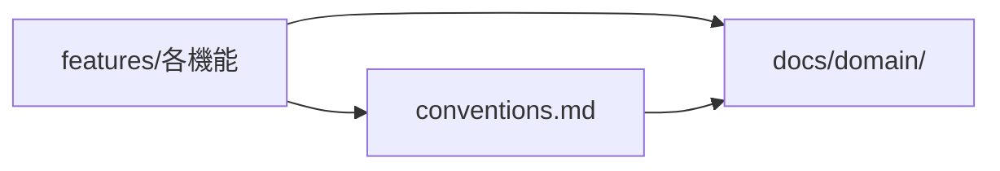

# システム仕様

このシステムが業務をどう実現するかを記述する。文の主語はシステムであり、業務そのもののルールは `docs/domain/` に置く。

## 文書一覧

| 文書 | 内容 | ID |
|---|---|---|
| [conventions.md](conventions.md) | 全エンドポイント共通の振る舞い | `AC-COMMON-<連番>` |
| [features/authorization.md](features/authorization.md) | 誰がどの対象を操作できるか | `AC-AUTHZ-<連番>` |
| [features/account.md](features/account.md) | 受講生と講師の登録・認証・自身の情報の更新 | `AC-ACCOUNT-<連番>` |
| [features/course-authoring.md](features/course-authoring.md) | 講座・チャプター・レッスンの作成と公開 | `AC-AUTHOR-<連番>` |
| [features/enrollment.md](features/enrollment.md) | 受講の登録・受講期限・定員 | `AC-ENROLL-<連番>` |
| [features/lesson-progress.md](features/lesson-progress.md) | 受講状況の作成と学習の記録・進捗の算出 | `AC-PROG-<連番>` |
| [features/progress-analytics.md](features/progress-analytics.md) | 学習状況の集計 | `AC-ANALYTICS-<連番>` |
| [features/notification.md](features/notification.md) | お知らせ | `AC-NOTIF-<連番>` |
| [features/tag.md](features/tag.md) | タグ | `AC-TAG-<連番>` |

## 参照の向き

機能仕様どうしの参照は、振る舞いの実体を持つ側へ向ける。

- 機能仕様から業務ルールを `BR-SHARED-<連番>` で参照する。業務ルールの説明を機能仕様側へ書き写さない
- 共通仕様に書いた振る舞いを機能仕様へ再掲しない。再掲してよいのは、その機能に例外があるときと、共通仕様と矛盾する扱いを打ち消す必要があるときだけである
- 振る舞いの実体は1か所にだけ置き、他の機能仕様からは `AC-<機能>-<連番>` で参照する。実体を2か所に書くと、変更のたびに片方が取り残される

## 実体がどこにあるか

| 振る舞い | 実体 |
|---|---|
| 認可の判定基準 | `features/authorization.md` |
| 受講状況の作成と完了の記録 | `features/lesson-progress.md` |
| 受講期限の算出と引き直し | `features/enrollment.md` |
| ページング・検索・並び替えの既定値 | `conventions.md` |
| 公開状態の遷移の制約 | `features/course-authoring.md`（遷移そのものの定義は BR-SHARED-008） |

## 対象外

このリポジトリは API のみを提供するため、画面の仕様（レイアウト・遷移・表示制御）は扱わない。画面側の都合で決まる振る舞いが必要になった場合も、API として観測できる振る舞いに翻訳してから機能仕様に書く。

## 更新するとき

- 同じ主題がすでに書かれていないかを `grep -rn` で確かめ、あれば ID を維持して上書きする。新しい主題のときだけ末尾に足す
- 受け入れ基準は「〜のとき、システムは〜しなければならない」の形で書く
- やらないことを「対象外」に必ず書く。書かないと過剰な実装が生まれる
- 未確定のことは仕様として書き切らず、`docs/domain/open-questions.md` に `Q-<連番>` として起こし、仕様側からは ID で参照する
