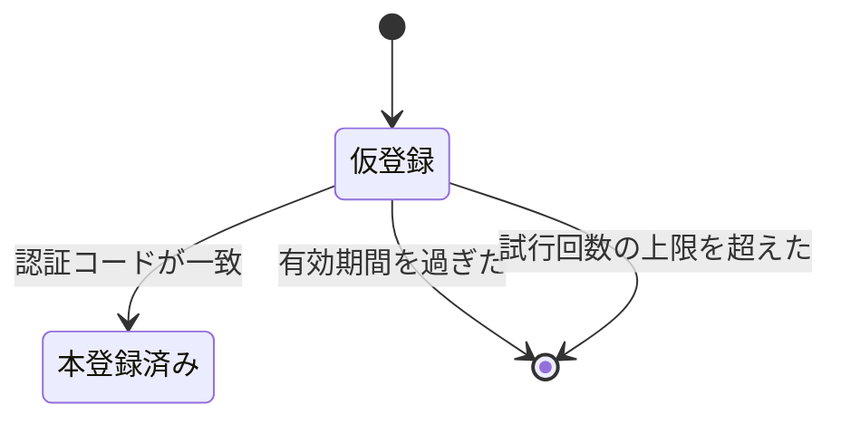

# アカウントの登録と認証

<!--
配置先は docs/specs/features/account.md である。
性質は状態を表す文書であり上書き更新する。
-->

## 目的

受講生と講師の登録・認証・自身の情報の更新を定める。共通仕様は `docs/specs/conventions.md`、認可は `docs/specs/features/authorization.md` に従う。

## 関連コンテキスト

主に `shared`（BR-SHARED-017・BR-SHARED-018・BR-SHARED-021）。

## 仮登録

1. `AC-ACCOUNT-001` 新規登録の要求があったとき、システムは本登録を行わず、仮登録として受け付けなければならない (BR-SHARED-017)。
2. `AC-ACCOUNT-002` 仮登録で受け付ける項目は次のとおりとしなければならない。

| 利用者 | 必須項目 |
|---|---|
| 受講生 | 呼び名・姓・名・メールアドレス・職業・目的・生年月日・性別・都道府県 |
| 講師 | 呼び名・姓・名・メールアドレス |

3. `AC-ACCOUNT-003` メールアドレスは、既存の受講生または既存の講師と重複してはならない。重複するときは 422 を返す。
4. `AC-ACCOUNT-004` 性別として受け付けるのは男性と女性のみとしなければならない。不明は受け付けない。
5. `AC-ACCOUNT-005` 仮登録を受け付けたとき、システムは 4 文字の認証コードと 10 文字の照会用の符号を生成し、いずれも既存の仮登録と重複しない値にしなければならない。
6. `AC-ACCOUNT-006` 重複しない値を 5 回試しても生成できなかったとき、システムは 400 を返し、仮登録を作成してはならない。
7. `AC-ACCOUNT-007` 認証コードの有効期間は仮登録の受付から 60 分としなければならない (BR-SHARED-017)。
8. `AC-ACCOUNT-008` 仮登録を作成したとき、システムは本人のメールアドレスへ認証コードと照会用の符号を送信しなければならない。
9. `AC-ACCOUNT-009` メールの送信は仮登録の確定後に行い、送信の失敗が仮登録の登録内容を巻き戻してはならない。

## 本登録

10. `AC-ACCOUNT-010` 本登録は照会用の符号で仮登録を特定し、認証コードとパスワードを受け取って行わなければならない。
11. `AC-ACCOUNT-011` パスワードは 8 文字以上とし、確認用の入力との一致を必須としなければならない。
12. `AC-ACCOUNT-012` 認証コードの有効期間を過ぎているとき、システムは仮登録を削除し、400 を返さなければならない (BR-SHARED-017)。
13. `AC-ACCOUNT-013` 認証コードが一致しないとき、システムは試行回数に 1 を加えて 400 を返さなければならない。
14. `AC-ACCOUNT-014` 試行回数が 3 回を超えたとき、システムは仮登録を削除し、400 を返さなければならない (BR-SHARED-017)。
15. `AC-ACCOUNT-015` 認証コードが一致したとき、システムは利用者を本登録し、仮登録を削除しなければならない。この2つは一体として行い、片方だけが成立してはならない。
16. `AC-ACCOUNT-016` 試行回数の記録と仮登録の削除は、本登録の処理単位に含めてはならない（本登録が巻き戻っても試行の記録は残す）。
17. `AC-ACCOUNT-017` マネージャーが手続きを始めた講師の本登録が成立したとき、システムはその講師をマネージャーの配下として登録しなければならない (BR-SHARED-018)。
18. `AC-ACCOUNT-018` 講師自身が手続きを始めた場合、システムはどのマネージャーの配下にも登録してはならない (BR-SHARED-018)。
19. `AC-ACCOUNT-019` 本登録した講師の区分は講師としなければならない。マネージャーの区分は本登録の経路では付与しない。

## ログイン

20. `AC-ACCOUNT-020` ログインは受講生と講師で別の経路として提供しなければならない。
21. `AC-ACCOUNT-021` 認証に失敗したとき、システムは 401 を返さなければならない。
22. `AC-ACCOUNT-022` 受講生の認証が成功したとき、システムはログイン履歴を1件記録し、最終ログイン日時を更新しなければならない。
23. `AC-ACCOUNT-023` ログイン履歴の記録に失敗したとき、システムは認証自体は成功として扱い、失敗の記録を残さなければならない。
24. `AC-ACCOUNT-024` 講師の認証ではログイン履歴を記録しない。
25. `AC-ACCOUNT-025` ログアウトの要求があったとき、システムはセッションを破棄しなければならない。認証されていない状態での要求も成功として扱う。

## 自身の情報の更新

26. `AC-ACCOUNT-026` 受講生は、呼び名・姓・名・メールアドレス・職業・目的・生年月日・性別・都道府県・プロフィール画像を更新できなければならない。
27. `AC-ACCOUNT-027` 講師は、呼び名・姓・名・メールアドレス・プロフィール画像を更新できなければならない。
28. `AC-ACCOUNT-028` メールアドレスの重複の判定では、自分自身の現在のメールアドレスを重複として扱ってはならない。
29. `AC-ACCOUNT-029` プロフィール画像の差し替えでは、差し替え前の画像を削除しなければならない (AC-COMMON-025)。
30. `AC-ACCOUNT-030` マネージャーは、自分自身と配下の講師の情報を更新できなければならない。配下でない講師を指定されたときは 403 を返す (BR-SHARED-003)。
31. `AC-ACCOUNT-031` 自身の情報の更新でパスワードは変更できない。

## 対象外

- パスワードの再設定・変更
- メールアドレスの変更時の再確認
- 二要素認証と外部の認証サービスとの連携
- 退会・アカウントの削除
- 受講生から講師への区分の変更、講師からマネージャーへの昇格
