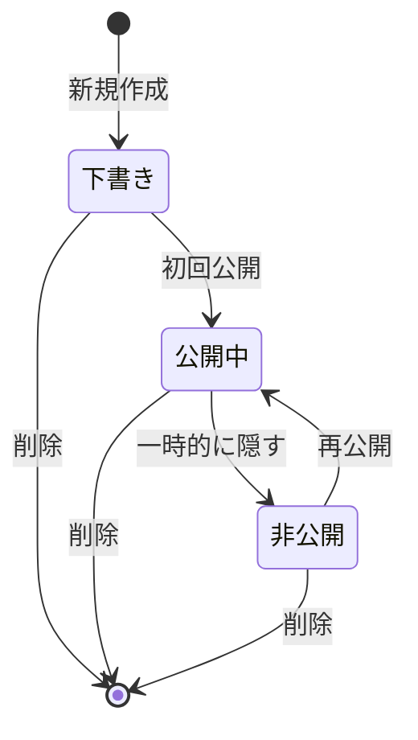
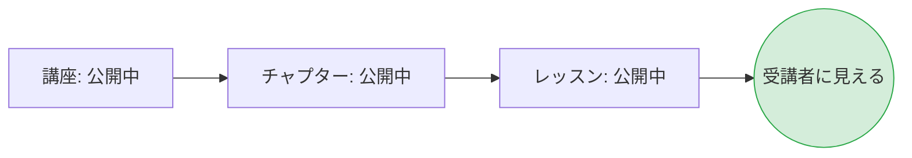
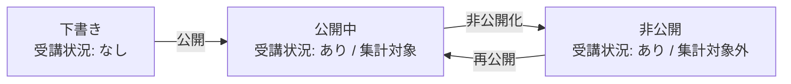

# 講座コンテンツの状態管理

このドキュメントでは、講座・チャプター・レッスンの公開状態と、それに関わる運用上のルールを整理します。今後、具体的なユースケースに応じた状態遷移もここに追記していきます。

## 概要

講座・チャプター・レッスンを「下書き」「公開中」「非公開」の3つの状態で管理します。これにより、編集中のコンテンツを誤って受講者に見せてしまうリスクを減らし、一度公開した内容を一時的に非公開にする運用も柔軟に行えるようにします。

## 背景

これまで講座・チャプター・レッスンは「公開」「非公開」の2状態のみで管理されていました。この方式では以下の2つの状況を区別できません。

- まだ一度も受講者に見せていない、作成中のコンテンツ
- かつて公開していたが、何らかの理由で一時的に非公開にしているコンテンツ

両者は性質がまったく異なります。前者はまだ受講者の体験に登場したことがない一方、後者はすでに受講登録した利用者が受講状況を持っている可能性があります。両者を同じ「非公開」として扱うと、運用上の意図が読み取れず、誤操作のリスクも残ります。

これを解消するため、状態を3つに整理します。

## 状態の定義

| 状態 | 意味 | 受講者から見えるか |
|---|---|---|
| 下書き | 作成中・準備中。まだ一度も受講者に公開していない | 見えない |
| 公開中 | 受講者に向けて公開している状態 | 見える |
| 非公開 | 一度公開した内容を、現在は受講者から隠している状態 | 見えない |

## 状態遷移

下書きから公開中へ進み、その後は公開中と非公開を必要に応じて行き来できます。
一度でも公開した状態から下書きに戻すことはできません。

下書きは「まだ何も始まっていない初期状態」を意味します。公開していた間に蓄積された情報(受講登録や受講状況など)を抱えたまま下書きに戻すと、データの意味が崩れるためです。再び隠したい場合は「非公開」を使います。

## 講座・チャプター・レッスンの関係

講座・チャプター・レッスンは、それぞれ独立した状態を持ちます。たとえば「講座は公開中だが、その中のチャプターは下書き」という組み合わせも許容します。

連携(=講座を非公開にしたらチャプターも自動的に非公開になる、など)は行いません。理由は以下の通りです。

- 各階層の状態は、その階層自体に対する講師の意思を表すものとして独立に管理したい
- 連携してしまうと、再度公開したときに「元の状態」が分からなくなり、講師の意図が失われる
- 受講者から見える条件は別途、すべての階層が公開中であることを要求するため、運用上の問題は生じない

## 受講者から見える条件

受講者がチャプターやレッスンを閲覧できるのは、所属するすべての階層が公開中であるときに限られます。

逆に、いずれか1つでも下書きまたは非公開であれば、受講者からはその配下のコンテンツが見えません。たとえば講座が非公開であれば、配下のチャプター・レッスンが公開中であっても受講者には何も表示されません。

| 講座 | チャプター | レッスン | 受講者から見えるか |
|---|---|---|---|
| 公開中 | 公開中 | 公開中 | 見える |
| 公開中 | 公開中 | 下書き / 非公開 | 見えない |
| 公開中 | 下書き / 非公開 | (任意) | 見えない |
| 下書き / 非公開 | (任意) | (任意) | 見えない |

## 受講登録の条件

受講者が新たに講座を受講登録できるのは、講座の状態が公開中であるときに限られます。下書きや非公開の講座は受講者には見えないため、新規の受講登録対象になりません。

すでに受講登録している講座が後から非公開や下書きに切り替わった場合の扱いは、次の「講座を非公開化したときの挙動」を参照してください。

## 講座を非公開化したときの挙動

公開中の講座が非公開に切り替わると、その時点ですでに受講登録している受講者にも影響があります。具体的な扱いは以下のとおりです。

- 講座そのものや配下のチャプター・レッスンが受講者から見えなくなる
- 受講登録は削除されない。再公開すれば、引き続き受講できる状態に戻る
- 受講状況も削除されず、これまでの進捗はそのまま保持される
- 進捗率や修了率の計算は現時点で公開中のレッスンを対象とするため、非公開化されたレッスンは集計対象から外れる

過去の受講者の取り組みは保持されますが、受講者の体験としては「その講座は一時的に提供を停止している」状態となります。

## 新規作成時の初期状態

講座・チャプター・レッスンは、新規に作成された時点ではすべて下書きとして登録されます。
講師は内容を整えたうえで、明示的に「公開する」操作を行うことで初めて受講者に届きます。

これにより「作成した瞬間から受講者に見えてしまう」事故を構造的に防ぎます。

## 既存データの取り扱い

すでに「公開」「非公開」として運用されている講座・チャプター・レッスンは、新しい状態モデルに移行した際もそのままの状態を維持します。

| これまでの状態 | 移行後の状態 |
|---|---|
| 公開 | 公開中 |
| 非公開 | 非公開 |

過去のデータを下書きに変換することはありません。下書きは「これから新しく作るもの」の初期状態として位置付けます。

## レッスンの受講状況の取り扱い

レッスンは受講者ごとの受講状況に直接結びつくため、状態の切り替えに加えて、受講状況の生成と保持に関するルールを定めます。

### 受講状況が生成される条件

レッスンの受講状況は、以下の2つが揃ったときに生成されます。

- 受講者がその講座に受講登録している
- レッスンの状態が下書きではない(= 公開中 または 非公開)

下書き状態のレッスンには受講状況は作られません。一度でも公開されたレッスン(現在は非公開のものも含む)には、受講登録した受講者ごとに受講状況が存在します。

### 受講状況が生成されるタイミング

受講状況は以下の2つのタイミングで生成されます。

1. 受講者が講座に受講登録したとき
   - その時点で「下書きではない」状態のレッスンすべてに対して、未着手の受講状況を作成
2. 講師がレッスンを下書きから公開中に切り替えたとき
   - その講座にすでに受講登録している受講者全員に対して、未着手の受講状況を作成

レッスンが非公開から公開中に戻る場合は、すでに受講状況が存在しているため、新たに生成は行いません。

### 受講状況の保持

一度生成された受講状況は、レッスンが非公開に戻されても削除されません。これにより以下を実現します。

- 講師がレッスンを一時的に非公開にしても、受講者の進捗が失われない
- 再度公開したときに、これまでの受講状況がそのまま引き継がれる

### 進捗集計の対象

修了率や進捗率などの集計値は、受講状況をもとに計算されます。集計の対象となるのは、判定時点で公開中のレッスンに限られます。

- 下書きのレッスンは受講状況がそもそも存在しないため、集計に含まれない
- 非公開のレッスンは受講状況は存在するが、現在は受講者に提供していない内容として集計から除外する
- 公開中のレッスンのみが集計対象となる

判定は常に「現時点で公開中のレッスン」を基準とするため、レッスンの公開状態が切り替わると、進捗率も連動して変動します。たとえば公開中レッスン10本のうち5本を完了している状態(進捗50%)で、未完了のレッスン1本が非公開化されると、対象は9本となり、完了済み5本を分子として進捗は約56%になります。逆に新しいレッスンが公開されると、対象が増えるぶん進捗率は下がります。

完了日時は不変として保持されますが、進捗率は現時点の状態をもとに動的に計算される値です。これらは別の性質を持つ情報として扱います。

### 状態と受講状況の関係

この設計により、講師は安心してレッスンの公開状態を切り替えることができ、受講者の受講状況は失われずに保持されます。

## 受講完了の取り扱い

### 完了の判定条件

受講者が、判定時点で公開中のレッスンをすべて完了したときに、その受講者の受講登録に完了日時が記録されます。

- 判定の基準は「現時点で公開中のレッスン」です。受講登録した時点でのレッスン構成ではありません
- 下書き状態のレッスンは判定対象外です(そもそも受講状況が存在しないため)
- 非公開状態のレッスンも判定対象外です(現時点で受講者に提供していないため)

たとえば、公開中レッスンがA・B・Cの3つあり、受講者がA・Bを完了している状態でBが非公開に切り替わった場合、判定対象は「A・C」に変わります。受講者がCを完了した時点で「公開中の全レッスンを完了」が成立し、完了日時が記録されます。

### 完了日時の不変性

一度記録された完了日時は、後から講師がレッスンを追加・公開した場合でも変更されません。完了後に新しいレッスンが追加されたときの挙動は以下のとおりです。

- すでに記録されている完了日時はそのまま保持される
- 追加されたレッスンに対しては、受講者ごとに未着手の受講状況が生成される
- 追加されたレッスンを後日完了しても、最初に記録された完了日時を上書きしない

これは「過去のある時点で講座を完了した」という事実を、後から追加されたコンテンツによって書き換えないようにする設計です。完了後に追加されたレッスンの取り組み状況は、新たに生成された受講状況として個別に記録されます。

## コンテンツの削除に関する制約

受講者の受講登録や受講状況に紐づくコンテンツは、原則として削除できません。これは、受講者に紐づく記録が意図せず失われることを防ぐためです。

### 講座の削除

すでに受講者が登録している講座は削除できません。講師が削除を試みた場合は操作が受け付けられず、エラーとして扱われます。

### チャプター・レッスンの削除

受講者の受講状況がすでに記録されているレッスンは削除できません。また、配下にそのようなレッスンを含むチャプターも削除できません。

### 提供を止めたい場合の対応

削除できない状況で提供を一時的に止めたい場合は、「非公開」状態への切り替えで対応します。
非公開にすれば受講者からは見えなくなりますが、過去の受講登録・受講状況・完了日時はすべて保持されます。再度公開すれば、これまでの情報を引き継いで提供を再開できます。
